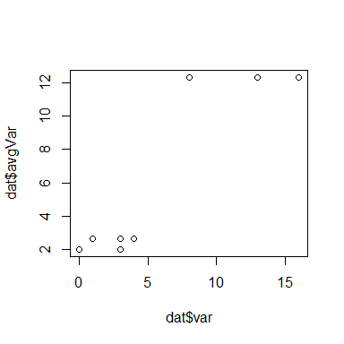

# Rough Outline: Pure, predictable, pipeable: A new data processing workflow for R


## Introduction

Just five years ago the basic data manipulation steps in the vast majority of world's R scripts relied on a standard workflow made up of common base functions that have existed in the R language since it was first developed [true? reference??]. You might have a sequence of steps that moved sequentially through `read.csv`, `merge`, `aggregate`, `order`, `subset`, `plot` (or perhaps `xyplot`) and then repeat. New packages for the first 5-10 years in R focused more broadly on adding functionality [is this true?] rather than altering key data manipulation workflows.

A typical example of the base workflow might look something like:


```r
dat <- read.csv("data/toy.csv")
dat[1:4,]
```

```
##   ID var
## 1  a  13
## 2  a   8
## 3  a  16
## 4  b   3
```

```r
avg <- aggregate(var~ID, data = dat, FUN = mean)
names(avg)[2] <- "avgVar"
dat <- merge(dat, avg, by = "ID")
dat <- dat[rev(order(dat$avgVar)),]
plot(dat$var, dat$avgVar)
```




The consistency in workflows makes it easy to share code and to re-use code written many years prior. Other advantages include [help needed]

At the same time, the base R functions in R suffer from limitations related to speed, predictability and consistency [help with this?]. As a result, R users developed packages to tackle specific limitations of base code.


## Alternatives to key data manipulation workflow

 `plyr` 2008 first version. `data.table` was 2006. Also `doBy`, `reshape2` etc provide alternatives to key data manipulation function. [Zev editorializing The uptake is hard to gauge but my sense is that people used these in dribs and drabs but few adopted them as a complete alternative to the base function]. [Is the following true: They were designed to replace specific functions and limitations but were not broad enough to replace entire workflows. Instead users adopted pieces but otherwise continued to use base. Not sure if this applies to `data.table` and I'm not sure how much `data.table` was adopted].

 A more ambitious effort to replace the traditional `base` workflows began with `dplyr`. [Again, `data.table` is an abitious effort to replace workflows and is great, but I'm not sure it was widely adopted. I, myself, used it for a while but I (A) often forgot the syntax and (B) the syntax is so different that when I shared scripts the user on the receiving end might have a hard time figuring out what I was doing.]
 

## Most recently the `dplyr`, `tidyr`, `magrittr` have taken off (?) when? Evidence of adoption of new approaches. Include `broom`, `purr`?

[Zev editorializing: my sense is this is the first time that an entirely new workflow has replaced the base functions for data manipulation purposes and has been adopted reasonably swiftly].

There are key reasons why this new workflow has been adopted compared to others. Pure, predictable, pipeable are the main reasons. Bache says to review [Eric Raymond’s 17 Unix Rules](https://en.m.wikipedia.org/wiki/Unix_philosophy) for additional discussion. [Zev editorializing: I personally think it also has a lot to do with Hadley's reach on social media and extensive outreach through talks etc not to mention creating useful documentation. These are strong components of the adoption in my opinion. With respect to predictable I think this is part of the reason why `data.table` has not taken off the way it should -- it's very hard to remember the syntax etc.]


## Pure, predictable, pipeable (note that for these notes I copied Hadley verbatim)

### Pure

"each function is easy to understand in isolation" (hadley). output only depends on input, makes no changes to state of world. You would use pure functions because easier to read and understand them in isolation, trivial to parallelise, trivial to moise (cache). There are times when you can't make it pure. The case study hadley uses is fortify lm. David's notes say Pure- constraint of no side effects to make good building blocks in a chain

### Predictable

"once you've understood one you've understood them all" (hadley). Learn once apply many times, don't need to memorise special cases easier to teach. Examples would include being consistent with puncutation, function names (verb vs noun, plurary singular), argument names and order, object types. Hadley gives example of read and write CSV where the first argument should be file in both. In David's notes Predictable- constraints on naming and on expected inputs and outputs (e.g. broom always returns a data frame). David (Last note is that the dialect aims to get rid of syntax operators that aren't %>% in favor of guessable, Google-able verbs. For example, reducing appearances of [], [[]], and $.)

### Pipeable

combine simple pieces with a standard tool. Predictable across packages not just within, learn once and apply in many situations. Data should be first argument. Use NSE judiciously, better to use one-sided formulas instead. 

Pipes have been around in R since (the beginning?). What's new and interesting about `magrittr`, why has it been adopted more broadly beyond being included in `dplyr`. David explains the real power of the `%>%` operator as "constrained grammars for manipulation". David references [Hadley's write up on data transformation](http://r4ds.had.co.nz/transform.html)

* Pipeable- constraint of data argument first (David)

* Hadley gives example of "turns function composition (hard to read) into sequence (easy to read)"

## Example

Jenny and Hadley suggested we use the example from [my blog post](http://zevross.com/blog/2015/01/13/a-new-data-processing-workflow-for-r-dplyr-magrittr-tidyr-ggplot2/) which would, of course, be the easiest way to proceed. So for now I've included just the first bit VERBATIM.

!! BEFORE RE-WORKING THE EXAMPLE I WANT TO CONFIRM THIS IS WHAT WE WANT SO THE CODE AND WORDING IS VERBATIM FROM BLOG POST!!

<h3>1) Grab sample data from Google</h2>

The package dplyr has several great functions to connect directly to external databases. We discuss this functionality in our previous post on dplyr. One of the functions is designed to extract data from Google's BigQuery [https://cloud.google.com/bigquery/what-is-bigquery]. This function (src_bigquery) uses code from the package bigrquery and I found that running the raw functions in bigrquery worked more smoothly.* Google has several nice sample tables to choose from [https://cloud.google.com/bigquery/docs/sample-tables]. We will use the word index for works of Shakespeare.

If you would rather skip the step of extracting data from Google, I've placed the full dataset on GitHub. If you want to follow along exactly as you see below you will need an account with Google and I put details on how to do this below. 


When you run the query_exec() function you will be asked if you ant to cache your Google authorization credentials. Choose "Yes" by typing "1". Your browser will open and you will need to click the "Accept" button after which the query will be processed. In my case, this took 34.7 seconds.


```
##        word word_count          corpus corpus_date
## 1      hive          1 loverscomplaint        1609
## 2 plaintful          1 loverscomplaint        1609
## 3       Are          1 loverscomplaint        1609
## 4      Than          1 loverscomplaint        1609
## 5  attended          1 loverscomplaint        1609
## 6      That          7 loverscomplaint        1609
```

```
## 'data.frame':	164656 obs. of  4 variables:
##  $ word       : chr  "hive" "plaintful" "Are" "Than" ...
##  $ word_count : int  1 1 1 1 1 7 1 1 1 1 ...
##  $ corpus     : chr  "loverscomplaint" "loverscomplaint" "loverscomplaint" "loverscomplaint" ...
##  $ corpus_date: int  1609 1609 1609 1609 1609 1609 1609 1609 1609 1609 ...
```


You can see that this is a relatively simple table.Now we have the data we're ready to use the magic of dplyr, tidyr and magrittr.

<h3>2) <code>dplyr</code>: tools for working with data frames</h2>

It turns out that there are multiple instances of words due to differences in case (lower, upper and proper case) and this gives us a very un-sexy introduction to the use of dplyr. Let's take a quick look using one word:


```
##    word word_count        corpus corpus_date
## 1 HENRY        122 kinghenryviii        1612
## 2 Henry          7 kinghenryviii        1612
## 3 HENRY        113  3kinghenryvi        1590
## 4 Henry         63  3kinghenryvi        1590
## 5 HENRY          1 rapeoflucrece        1609
## 6 HENRY        122 kingrichardii        1595
```

Here we use the filter verb to extract records and, yes, we need to do something about the repeated words. We will aggregate by lower case word, corpus and corpus date, summing all the instances of the word.


```
## Source: local data frame [6 x 4]
## Groups: word, corpus [6]
## 
##    word       corpus corpus_date word_count
##   <chr>        <chr>       <int>      <int>
## 1 henry 1kinghenryiv        1597        255
## 2 henry 1kinghenryvi        1590        103
## 3 henry 2kinghenryiv        1598        133
## 4 henry 2kinghenryvi        1590        162
## 5 henry 3kinghenryvi        1590        176
## 6 henry   kinghenryv        1599        194
```

Better. Now let's use dplyr here to take a quick look at what the most and least popular words are by computing the total times each word occurs across all of Shakespeare's works. We will use dplyr at its most basic to start, grouping by word, summing occurrences (total), counting the numer of Shakespeare works they occur in (count) and arranging by total occurrences (in descending order).


OK, this worked like a charm and, in my opinion, cleaner than using base functions (getting variable names right with aggregate, for example, is a pain) but there are a lot of unnecessary keystrokes and we create some unecessary interim objects (grp, cnts). Let's try a different way.


## Conclusion

### A new, pure, predictable pipeable workflow

### Concerns

(Hadley) Should we worry about R diverging into mutually incomprehensible dialects?  [Other concerns]


## References

Hadley talk

[NYT, data analysts captivated by R's power](http://www.nytimes.com/2009/01/07/technology/business-computing/07program.html?pagewanted=all&_r=0)

[R You Ready for R, this is response to initial article](http://bits.blogs.nytimes.com/2009/01/08/r-you-ready-for-r/)

NYT article says there is a history of R at end of "Software for Data Analysis: Programming with R" by Chambers

[This URL has list of pure, predictable pipeable R packages](https://docs.google.com/spreadsheets/d/1xHKTQC1Htrfz4kvhiD4m6YVtzM73RSpcTt3yxB7gtQg/edit#gid=0)
